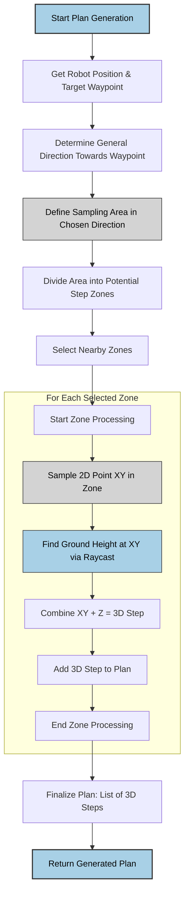
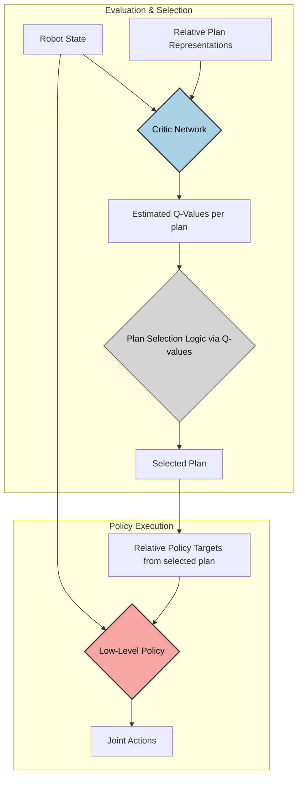

# CPSC448Report
# Report: Procedural Locomotion Planning via Reinforcement Learning

Written By: Radman Rakhshandehroo 

Supervisor: Dr. Michiel van de Panne, Nick Ioannidis

## 1. Project Overview

This report details the development and implementation of a novel system attempting to enable a 3D bipedal robot (`Walker3D`) to navigate complex, dynamically generated environments. We use **procedural footstep generation** and **Reinforcement Learning (RL)**, specifically Q-learning, allowing the agent to intelligently select viable paths from multiple runtime-generated options. This is a modification and simplification of previous work done in the MOCCA Lab where we remove the diffusion model used for path and foothold location generation and swap it with the procedural step generation. Furthermore, we simplify and significantly reduce the size of height-map from a $32*32$ grid. We retain the idea of the viability filters and use them to determine the best plans that allow us to choose the best sequences of steps that would allow us to navigate challenging terrain. Once a plan is chosen by the viability filter, this plan would be passed to ALLSTEPS controller, a high frequency robust locomotion policy.

## 2. Detailed Contributions & Development Areas

### 2.1. Procedural Step Generation & Environment Integration (`walker3d_envs.py`, `stepper_logic.py`)

*   **Core Dynamic Footstep Planning:** Implemented a novel approach where potential footstep locations ("plans") are not predefined but are generated dynamically during simulation (`_generate_runtime_targets`, `_update_procedural_targets`). This allows the robot to react to immediate terrain context rather than relying on static paths.
*   **Waypoint-Guided Navigation:** Integrated a high-level waypoint system (`waypoint_locations`, `current_waypoint_index`, `_check_and_advance_waypoint`) to provide long-range navigational goals. The procedural generation is biased towards the current waypoint (`_get_current_target_waypoint`).
*   **Sampling Algorithm:** Developed a sampling strategy where potential steps are generated within a rectangular region oriented towards the target waypoint. This rectangle is parametrically defined (`stepper_rect_width`, `stepper_rect_height`) and subdivided (`stepper_section_height`, `divide_rectangle_into_sections`) to create distinct candidate step locations.
*   **Noise Injection:** Introduced non-uniform noise (`stepper_noise_parallel_stddev`, `stepper_noise_perpendicular_stddev`) during the sampling process (`sample_point_in_section_with_noise`). The addition of these noises allows for high diversity for foothold locations. 
*   **Multi-Plan Generation & Evaluation:** The system generates a configurable number (`num_procedural_plans`) of plans at when the foot of the moving leg hits its target foothold location. This provides a diverse set of options for the RL agent to evaluate, increasing the chances of finding a viable path in challenging terrain.
*   **Height Sampling:** Leveraged the environment's raytesting (`get_height_from_coordinate`) to accurately determine the Z-coordinate (height) for sampled XY footstep locations.
*   **Algorithmic Foundation (`stepper_logic.py`):** This module encapsulates the foundational geometric algorithms for vector manipulation (`pick_vector_in_range`, `find_vectors_at_angle`), rectangle creation (`create_rectangle_with_vector`), section division, and obstacle checking (`check_path_obstacle_collision`). For more information on how all of these components are used together, see Appendix A. 

### 2.2.  Reinforcement Learning Framework (`train_procedural_q.py`)
*   **Q-Learning for High-Level Decision Making:** Implemented a Q-learning algorithm specifically tailored to *select* among the all of the procedurally generated plans. Once a plans is chosen, ALLSTEPS policy handles the low level actions needed for reaching the proposed immediate foothold in the selected plan. Q-function (viability filter) tackles the high-level pathfinding aspect of locomotion (See Appendix B).
*   **Custom Critic Architecture (`ProceduralPlanCritic`):** Designed and implemented a dedicated neural network critic. This network takes the robot's current state and a *plan representation* as input and outputs the estimated Q-value (long-term reward) for choosing that specific plan. It features MLPs to process robot state and combines these features with the plan representation before feeding into the final Q-value layers.
*   **Specialized Agent-Environment Loop:** Orchestrated the interaction:
    1.  Environment generates `num_procedural_plans` global plans (`_update_procedural_targets`).
    2.  Plans are converted into a dense, relative representation (`get_plan_representation`) in accordance with the input design of ALLSTEPS policy. 
    3.  Critic evaluates available plans; agent selects one using epsilon-greedy exploration (`segment_chosen_plan`). 
    4.  *Selected* global plan's initial steps guide a pre-existing low-level locomotion policy (`actor_critic`).
    5.  Segmented transitions (state, chosen plan, accumulated reward, next state, next plans) are stored (`ReplayBuffer.push`).
    6.  Critic network updates leverage the Bellman equation, comparing current Q-values with target Q-values derived from the reward and the *maximum* Q-value achievable in the next state across *all* available next plans (`update_critic_network`).
*   **Segment-Based Updates & Rewards:** A segment can be defined as the time from which the foot is lifted from the ground at time $t$ up to time $t+1$ where the same foot reaches the proposed foothold location. Once a segment has ended new plans are generated. Rewards (`critic_reward_value`) are accumulated over the multiple segments and transitions are stored upon completion. This aligns the Q-learning updates with meaningful behavioral milestones.

### 2.3. Novel State and Plan Representation (`walker3d_envs.py`, `train_procedural_q.py`)
*   **Contextual Plan Representation (`get_plan_representation`):** Developed a novel and rich representation for footstep plans provided to the critic. Beyond relative XYZ coordinates, this function samples and includes a multi-point **height profile** along the linear path between consecutive steps. This provides the critic with crucial local terrain geometry information associated with executing that part of the plan.
*   **Configurable Representation:** Added flexibility via the `--exclude_plan_heights` argument, for training scenarios where the critic relies solely on relative coordinates. This is used for training on flat ground to see if the Q-function can effectively pick the best plans. 
### 2.4. Enhanced Environment Capabilities (`walker3d_envs.py`)
*   **Integrated Waypoint System:** Implemented waypoint tracking (`current_waypoint_index`), distance checking (`_check_and_advance_waypoint`), and target updating (`_get_current_target_waypoint`) directly within the environment dynamics.
*   **Dynamic Curriculum Interface:** Exposed methods (`set_box_height`, `set_boxed_environment_active`) allowing external control (from `train_procedural_q.py`) over environment parameters based on training progress, enabling automated difficulty scaling.
*   **Task-Specific Reward Engineering:** These rewards are used (`calc_step_reward`, `WAYPOINT_REWARD_SCALE`, `FOOTHOLD_REWARD_SCALE`) to provide meaningful learning signals for both the low-level policy (via `reward` in `step`) and the high-level Q-learning agent (via `critic_reward_value` calculated in the training loop). The current reward structure uses stay alive bonus (by reaching a foothold) and waypoint reward. The waypoints that appear later in the path have higher rewards.
*   **Advanced Visualization Tools:** Added PyBullet visualizations for multiple procedural plans (`selected_plan_viz`, `other_plans_viz` differentiating selected vs. other plans), and detailed plan height profiles (`render_plan_heightmap`), for debugging and understanding agent behavior (see Appendix C). 

### 2.5. Robust Training & Experimentation Infrastructure (`train_procedural_q.py`)

*   **Structured Curriculum Learning:** Implemented a multi-stage curriculum (`CURRICULUM_LEVELS`) controlled by agent performance (`success_tracker`, `success_threshold`, `performance_window`), automatically increasing task difficulty (e.g., episode length, obstacle height) as the agent improves.
*   **Hyperparameter Management & Logging:** Leveraged `argparse` for easy configuration of numerous training parameters and integrated `wandb` for comprehensive logging of metrics (losses, rewards, curriculum progress, hyperparameters), enabling systematic experimentation and analysis.
*   **Stable Training Practices:** Incorporated standard RL techniques like target networks (`target_critic`), soft updates (`target_network_update`), replay buffers (`ReplayBuffer`), and epsilon-greedy exploration schedule (`epsilon_by_step`).
*   **Checkpointing & Code Organization:** Implemented model saving (`torch.save`) at regular intervals and organized code into distinct files for environment logic, training loops, and potentially core algorithms (`stepper_logic.py`).

## 3. Project Scope

*   **Code Volume:** The modified logic spans approximately **3500+ lines of Python code** (added or modified excluding the pre-existing codebase) distributed across the key files (`train_procedural_q.py`, `walker3d_envs.py`, `stepper_logic.py`). This does not include potential utility files, low-level robot controllers, or external libraries.
*   **Novelty:** The approach of using RL to select among *procedurally generated* footstep plans, especially with the inclusion of detailed height profiles in the plan representation, constitutes a novel contribution to robotic locomotion control.
*   **Challenges:** Currently, in the process of training the viability filter to be stable on the ground but have not been able to achieve this due to some issue. Further exploration and testing showed that critic loss stops declining after a few episodes and the `sucess_threshold` of the viability filter is **50%** (over a rolling window of 20 episodes in the training) on flat ground while it should be able to achieve close to 100% due to the robust locomotion policy of ALLSTEPS.

## 4. Conclusion
This project implemented a novel approach combining procedural footstep generation with a Q-learning viability filter for Walker3D locomotion, replacing previous diffusion-based methods. Significant development established the core components: dynamic step generation within the environment, a rich plan representation including height profiles, and the RL training framework.

However, the system currently faces critical Q-learning instability. The viability filter's training stalls, achieving only ~50% success on flat ground, far below expectations given the robust low-level policy. Debugging is needed to resolve the training issues and validate this procedural planning approach for reliable locomotion. The immediate next step is to achieve the stability and high success rate on the flat ground and then kick in the curriculum learning.

# Appendix
## A. Overview of step selection process


## B. Architecture diagram 

## C. Renders of learning
Note that the renders below are intended as demonstration of how the training process 'looks'. Due to the bug mentioned in project scope, curriculums beyond initial flat ground one have not been reached yet but the mechanism for them has been implemented. 

Sphere Color guide: 
- ${\color{red}{Red}}$ sphere is the start point of the humanoid. 
- ${\color{grey}{Grey}}$ spheres indicates sets of plans (and their footholds) that were not chosen. 
- ${\color{orange}{Orange}}$ spheres indicates the steps and foothold position of the plan that was chosen.
- ${\color{green}{Green}}$ spheres indicate the heightmap locations. the intensity increases if the sampled point has higher elevation (along z axis).
### C1: Render of learning on flat ground 
```python
python train_procedural_q.py --exclude_plan_heights --render
```
Flat ground is curriculum level 0. The heights are excluded from the plans. Demo:


https://github.com/user-attachments/assets/2b80e45a-0b7d-4aa9-b0e7-346e6443d396


### C2: Render of learning on boxed environment
```python
python train_procedural_q.py --render
```
Boxed environment with box height of 0.4 is curriculum level 3. Demo: 


https://github.com/user-attachments/assets/f591ad7a-d65f-43fd-8a84-87eeaa056ae3


